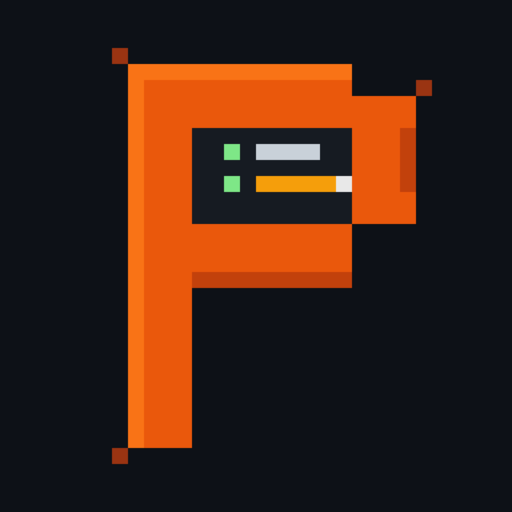
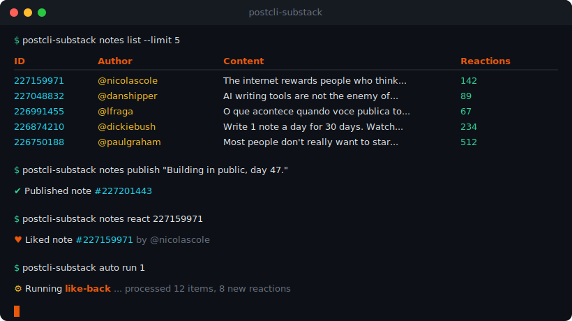
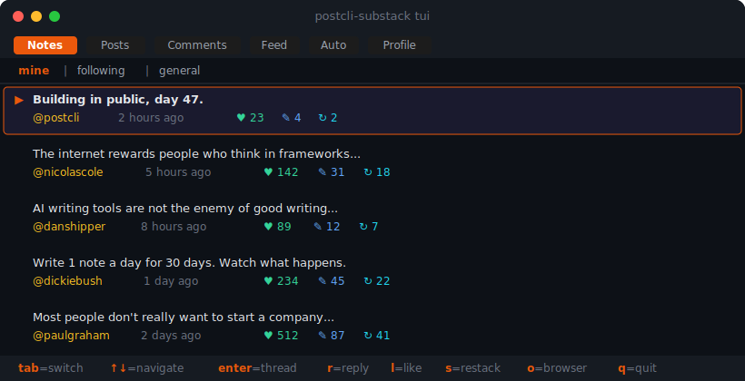
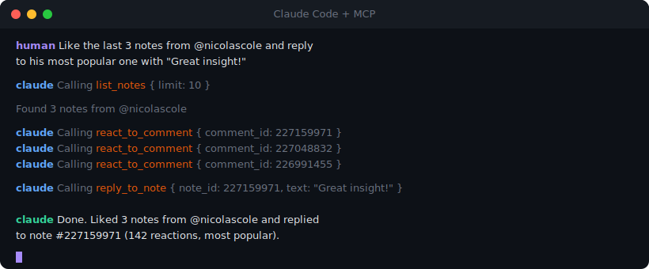

<div align="center">



# @postcli/substack

**Your entire Substack, from the terminal.**

Read posts. Publish notes. Automate engagement. Power AI agents.

[](https://www.npmjs.com/package/@postcli/substack)
[](https://www.npmjs.com/package/@postcli/substack)
[](https://github.com/postcli/substack/actions)
[](LICENSE)
[](package.json)
[](https://modelcontextprotocol.io)
[](https://github.com/postcli/substack/issues)

<br/>

[Getting Started](#getting-started) &#8226;
[CLI](#cli) &#8226;
[TUI](#interactive-tui) &#8226;
[MCP Server](#mcp-server) &#8226;
[Automations](#automations) &#8226;
[API](#programmatic-api) &#8226;
[Contributing](#contributing)

</div>

<br/>

<p align="center">
  
</p>

<br/>

## Why PostCLI?

Substack has no public API. PostCLI fills that gap with a fast, local-first toolkit that puts your entire Substack workflow in the terminal, in a TUI, or behind an AI agent.

<table>
<tr>
<td width="25%" align="center">

**CLI**

Full command suite for posts, notes, comments, profiles, and engagement. Pipe-friendly `--json` output.

</td>
<td width="25%" align="center">

**TUI**

Interactive terminal UI with 6 tabs, sub-views, keyboard shortcuts, mouse scroll, and thread navigation.

</td>
<td width="25%" align="center">

**MCP Server**

16 tools for Claude, GPT, and any MCP-compatible AI agent. Read, write, and engage, all through natural language.

</td>
<td width="25%" align="center">

**Automations**

Like-back, auto-reply, auto-restack with SQLite-backed dedup engine. No cloud required.

</td>
</tr>
</table>

## Getting Started

### Prerequisites

- **Node.js 18+** (LTS recommended)
- **Chrome/Chromium** with an active Substack session (for auto cookie grab)
- macOS or Linux (Windows support [tracked here](https://github.com/postcli/substack/issues/5))

### Install

```bash
npm install -g @postcli/substack
```

### Authenticate

PostCLI grabs session cookies directly from Chrome. Just be logged into Substack in your browser:

```bash
postcli-substack auth login
```

Alternative methods: email OTP or manual cookie paste. See the [auth guide](docs/auth.md).

### Verify

```bash
postcli-substack auth test
# Connection successful. Logged in as @yourhandle
```

### First commands

```bash
postcli-substack posts list               # see your posts
postcli-substack notes publish "Hello!"    # publish a note
postcli-substack tui                       # launch the TUI
```

## CLI

### Read

```bash
postcli-substack posts list                          # your posts (all publications)
postcli-substack posts list --subdomain techblog     # specific publication
postcli-substack posts get --slug my-latest-post     # full post in markdown
postcli-substack notes list --limit 20               # recent notes
postcli-substack comments list 12345                 # comments on a post
postcli-substack feed list --tab for-you             # reader feed
postcli-substack profile me                          # your profile
postcli-substack profile get nicolascole77           # someone else's profile
```

### Write

```bash
postcli-substack notes publish "Hello world"                # publish a note
postcli-substack notes publish "Something **bold**"         # markdown support
postcli-substack notes reply 12345 "Great point"            # reply to a note
postcli-substack comments add 12345 "Nice post!"            # comment on a post
```

### Engage

```bash
postcli-substack posts react 12345                   # heart a post
postcli-substack notes react 67890                   # heart a note
postcli-substack comments react 11111                # heart a comment
postcli-substack posts restack 12345                 # restack a post
postcli-substack notes restack 67890                 # restack a note
```

### JSON output

Every command supports `--json` for piping and scripting:

```bash
postcli-substack posts list --json | jq '.[0].title'
postcli-substack notes list --json --limit 5 | jq '.[] | .id'
```

[Full CLI reference &rarr;](docs/cli.md)

## Interactive TUI

```bash
postcli-substack tui
```

<p align="center">
  
</p>

### Tabs

| Tab | What it shows |
|-----|---------------|
| **Notes** | Your notes, following, and general feed with sub-tabs |
| **Posts** | Posts from your publications with mine/following/general |
| **Comments** | Thread view with parent and child context |
| **Feed** | Reader feed (for-you, subscribed, categories) |
| **Auto** | Automation rules and execution logs |
| **Profile** | Your profile and publication list |

### Keybindings

| Key | Action |
|-----|--------|
| `tab` | Switch between tabs |
| `1-3` | Switch sub-tabs (mine / following / general) |
| `up/down` | Navigate items |
| `enter` | Open thread / detail view |
| `r` | Reply to note |
| `l` | Like / heart |
| `s` | Restack |
| `o` | Open in browser |
| `q` / `esc` | Back / quit |

Mouse scroll is supported for navigation.

[TUI guide &rarr;](docs/tui.md)

## MCP Server

Connect your Substack to Claude, GPT, or any AI agent via the [Model Context Protocol](https://modelcontextprotocol.io).

<p align="center">
  
</p>

### Start the server

```bash
postcli-substack --mcp
```

### Claude Code

Add to `.claude/settings.json`:

```json
{
  "mcpServers": {
    "substack": {
      "command": "postcli-substack",
      "args": ["--mcp"]
    }
  }
}
```

### Claude Desktop

Add to `claude_desktop_config.json`:

```json
{
  "mcpServers": {
    "substack": {
      "command": "postcli-substack",
      "args": ["--mcp"]
    }
  }
}
```

### Available tools (16)

| Tool | Description |
|------|-------------|
| `test_connection` | Test authentication |
| `get_own_profile` | Your profile and publications |
| `get_profile` | Profile by subdomain |
| `list_posts` | List posts (all pubs or specific) |
| `get_post` | Full post by slug |
| `get_post_by_id` | Full post by numeric ID |
| `list_notes` | Notes from feed |
| `list_comments` | Comments on a post |
| `get_feed` | Reader feed |
| `publish_note` | Publish a new note |
| `reply_to_note` | Reply to a note |
| `comment_on_post` | Comment on a post |
| `react_to_post` | Heart a post |
| `react_to_comment` | Heart a comment/note |
| `restack_post` | Restack a post |
| `restack_note` | Restack a note |

[Full MCP reference &rarr;](docs/mcp.md)

## Automations

Local, SQLite-backed automation engine with deduplication. Runs on your machine, no cloud needed.

```bash
# See available presets
postcli-substack auto presets

# Create from preset
postcli-substack auto create "like-back" --preset 1

# Run once
postcli-substack auto run 1

# Manage
postcli-substack auto list
postcli-substack auto toggle 1      # enable/disable
postcli-substack auto remove 1      # delete
```

### Built-in presets

| # | Preset | Trigger | Action |
|---|--------|---------|--------|
| 1 | Like back | Someone likes your note | Like their latest note |
| 2 | Auto-reply to likes | Someone likes your note | Reply with thank you |
| 3 | Auto-restack | New note from a handle | Restack it |
| 4 | Follow back | New follower | Follow them back |

Custom automations can combine any trigger + action. See the [automations guide](docs/automations.md).

## Programmatic API

Use the client in your own Node.js projects:

```typescript
import { SubstackClient } from '@postcli/substack/client';

const client = new SubstackClient({
  token: process.env.SUBSTACK_TOKEN,
  publicationUrl: 'https://yourpub.substack.com',
});

// Read
const posts = await client.listPosts({ limit: 5 });
const notes = await client.listNotes({ limit: 10 });
const profile = await client.ownProfile();

// Write
await client.publishNote('Published via API');
await client.replyToNote(12345, 'Great note!');
await client.commentOnPost(67890, 'Nice post');

// Engage
await client.reactToPost(12345);
await client.reactToComment(67890);
await client.restackPost(12345);
```

[API reference &rarr;](docs/api.md)

## Project Structure

```
src/
  cli/
    commands/      # auth, posts, notes, comments, profile, social, auto
    tui/           # Interactive terminal UI (React + Ink)
    automations/   # SQLite-backed automation engine
    formatters.ts  # Output formatting (markdown, tables, colors)
    chrome-cookies.ts  # Chrome cookie extraction
  lib/
    substack.ts    # SubstackClient (core API wrapper)
    http.ts        # HTTP client with throttling
    models.ts      # Domain models (Post, Note, Comment, Profile)
    types.ts       # Substack API response types
  mcp/
    index.ts       # MCP stdio server
    tools.ts       # 16 tool definitions + handlers
  client.ts        # Client initialization & config
  plugin.ts        # Plugin registration for PostCLI ecosystem
```

## Roadmap

Track progress and vote on features via [GitHub Issues](https://github.com/postcli/substack/issues).

- [x] Read posts, notes, comments, feed
- [x] Publish notes, reply, comment on posts
- [x] React (heart) and restack
- [x] Interactive TUI with 6 tabs
- [x] MCP Server for AI agents (16 tools)
- [x] Automation engine with presets
- [x] Thread view with parent + child context
- [x] Chrome cookie auto-grab
- [x] Profile feed (your activity)
- [ ] [Publish full posts (draft + publish)](https://github.com/postcli/substack/issues/1)
- [ ] [Analytics dashboard](https://github.com/postcli/substack/issues/2)
- [ ] [Multi-account support](https://github.com/postcli/substack/issues/3)
- [ ] [Scheduled automations (daemon)](https://github.com/postcli/substack/issues/4)
- [ ] [Windows support](https://github.com/postcli/substack/issues/5)
- [ ] [Search posts and notes](https://github.com/postcli/substack/issues/6)
- [ ] [Subscriber management](https://github.com/postcli/substack/issues/7)
- [ ] [Notification feed](https://github.com/postcli/substack/issues/8)

## Contributing

Contributions are welcome. Here's how to get started:

### Setup

```bash
git clone https://github.com/postcli/substack.git
cd substack
npm install
npm run build
npm test
```

### Development

```bash
# Run CLI in dev mode
npm run cli -- notes list

# Run MCP with inspector
npm run dev:mcp

# Run tests
npm test
```

### Guidelines

1. **Open an issue first** to discuss the change you'd like to make
2. Fork the repo and create a branch from `main`
3. Write tests for new functionality
4. Run `npm test` and `npm run build` before submitting
5. Keep PRs focused on a single change

### Good first issues

Looking for something to work on? Check issues labeled [`good first issue`](https://github.com/postcli/substack/issues?q=is%3Aissue+is%3Aopen+label%3A%22good+first+issue%22) or [`help wanted`](https://github.com/postcli/substack/issues?q=is%3Aissue+is%3Aopen+label%3A%22help+wanted%22).

## Authentication

PostCLI auto-grabs session cookies from Chrome. You must be logged into Substack in your browser.

```bash
postcli-substack auth login
```

Three auth methods:

| Method | Command | How it works |
|--------|---------|--------------|
| **Chrome grab** (default) | `auth login` | Reads cookies directly from Chrome's SQLite DB |
| **Email OTP** | `auth login --subdomain yourpub` | Sends a magic link to your email |
| **Manual paste** | `auth setup` | Paste cookies from Chrome DevTools |

Credentials are stored at `~/.config/postcli/.env` with `0600` permissions (owner-only read/write).

[Auth setup guide &rarr;](docs/auth.md)

## Disclaimer

This is an unofficial tool, not affiliated with or endorsed by Substack. It interacts with undocumented APIs that may change without notice. Use at your own risk.

## License

[AGPL-3.0](LICENSE)
